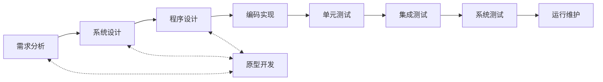
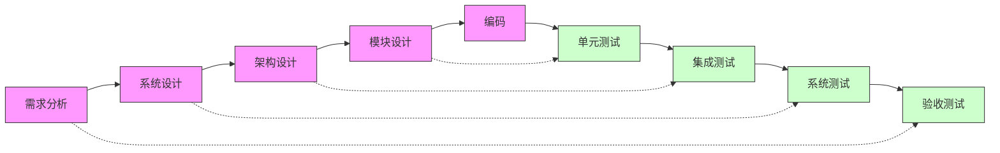

# 定义
- P(Plan): 软件规格说明。规定软件功能及其运行时的限制
- D(Do): 软件开发。开发出满足规格说明的软件
- C(Check):软件确认。确认开发的软件能够满足用户需求
- A(Action): 软件演进。软件在运行过程中不断改进以满足客户新的需求
# 软件开发方法
基本不考
## 形式化方法
净室软件工程：
三个缺点：
1. 对开发人员要求较高
2. 正确性验证步骤比较困难，且比较耗时
3. 开发小组不进行传统的模块测试，这是不现实的

## 逆向工程
逆向工程是设计的恢复过程。（重点）
人话：通过源代码分析出更高层级的抽象信息（例如实际功能等）
相关概念：  
1. 重构restructuring：重构是指在同一抽象级别上转换系统描述形式
2. 设计恢复design recovery：设计恢复是指借助工具从已有程序中抽象出有关数据设计、总体结构涉及和过程设计等方面的信息
3. 再工程re-engineering：再工程是指在逆向工程所获得信息的基础上，修改或重构已有的系统，产生系统的一个新版本。（包括重构、设计恢复和正向工程）
4. 正向工程Forward Engineering：正向工程是指不仅从现有系统中恢复设计信息，而且使用该信息去改变或重构现有系统，以改善其整体质量。

恢复的抽象层次：
- 实现级：程序的抽象语法树、符号表等信息
- 结构级：相互依赖调用关系
- 功能级
- 领域级

## 基于构件的软件工程
CBSE (Component-Based Software Engineering)
通过复用可重用的软件构件来构造高质量、高效率的应用软件系统。

构件特性：
记忆口诀：竹鼠档毒镖
1. 可组装性
2. 可部署性：自包含的，能够作为独立实体在构件平台上运行，以二进制形式部署而无需编译
3. 文档化
4. 独立性：无需其他特殊构件的情况下进行组装和部署，只有在确实需要时才声明依赖（最小依赖）
5. 标准化
6. （补充）没有（外部的）可见状态：独立性的补充，体现封装，调用者无法干预其状态

主要活动：
记忆口诀：虚竹师傅羞涩的定住了
1. 系统需求概览
2. 识别候选构件
3. 修改需求：教育用户的需求匹配自己的能力
4. 体系结构设计
5. 构件定制与匹配
6. 组装构件

组装：
1. 顺序组装（时序）：需保证上下游构件接口兼容
2. 层次组装（层级）：需接口匹配（一个构件直接调用另一构件提供的服务）
3. 叠加组装（合并）：多个构件的功能合并到一个新构件中，提供统一接口（例如智能家居控制中心构件，提供统一接口控制所有功能）

常见问题：
1. 参数不兼容 
2. 操作不兼容：提供和请求接口操作名不同、不规范 
3. 操作不完备：一个接口是另一个接口的子集，功能耦合没分开

# 软件开发/过程/生命周期模型
软件开发模型给出了**软件开发活动各阶段**之间的关系，它是软件开发过程的概括，是软件工程的重要内容。

软件要经历从**软件定义、软件开发、软件运行、软件维护（软件生命周期方法学），直至被淘汰这样的全过程**，这个全过程称为软件的生命周期。软件生命周期描述了软件从生到死的全过程。为了使软件生命周期中的各项任务能够有序地按照规程进行（先做什么后做什么），需要一定的工作模型对各项任务给予规程约束，这样的工作模型被称为软件过程（开发）模型，有时也称之为软件生命周期模型。

软件开发模型分类：
- 软件需求完全确定为前提：瀑布模型
- 迭代式或渐进式：喷泉模型、螺旋模型、统一开发过程和敏捷方法
- 形式化开发：变换模型

## 瀑布模型
1. 定义阶段：软件计划<=>需求分析<=>
2. 开发阶段：软件设计<=>程序编码<=>软件测试->运行维护
缺点：
3. **依赖于早期进行的需求调查，不能适应需求的变化**
4. 软件需求的完整性、正确性等很难确定，甚至是不可能和不现实的

## 原型模型

1. 原型开发阶段
2. 目标软件开发阶段

- 后续演变：
	- 抛弃型原型（快速模型）
	- 演化性原型（变化模型）

## 螺旋模型
**结合瀑布模型的结构化方法和原型模型的迭代特性**，加入两者所忽略的**风险分析**。（在之前的每个环节加的）

在螺旋模型中，软件开发是一系列的**增量发布**。

螺旋模型沿着螺线进行若干次迭代，每次迭代都包括**制订计划（目标设定）、风险分析、实施过程和客户评估**4个方面的工作。

## V模型
V模型由于将整个开发过程构造成一个V字形而得名。

这里需要注意的是：验收测试是对需求分析的测试，系统测试是对概要设计的测试，集成测试是对详细设计的测试，单元测试是对编码阶段的测试。 

**但是系统测试的依据是需求分析，集成测试的设计依据是概要设计，单元测试的设计依据是详细设计。**（因为概要设计的依据是需求分析，而系统测试是对概要设计的测试，所以系统测试的依据是需求分析，其他同理） 

**V模型强调软件开发的协作和速度，将软件实现和验证有机地结合起来，** 在保证较高的软件质量情况下缩短开发周期。

## 统一过程※

UP/RUP
三个显著特点：**用例驱动、以架构为中心、迭代和增量**（必考）
![[Pasted image 20250320173039.png]]
RUP软件开发生命周期是一个二维的软件开发模型。
纵轴是9个核心工作流。
横轴是4个连续的阶段，初始、细化、构造、交付，每个阶段完成确定的任务。

## 敏捷方法※
敏捷方法是一种**以人为核心、迭代、循序渐进、增量**的开发方法。在敏捷方法中，软件项目的构建被切分成多个子项目，各个子项目的成果都经过测试，具备集成和可运行的特征（**这里是同义词，在软件工程中，迭代（Iteration)是指将整个开发过程分解为多个小的、重复的周期性活动。每个迭代周期通常包括需求分析、设计、开发、测试和交付等环节**）。在敏捷方法中，从开发者的角度来看，主要的关注点有短平快的会议、小版本发布、较少的文档、合作为重、客户直接参与、自动化测试、适应性计划调整和结对编程；从管理者的角度来看，主要的关注点有测试驱动开发、持续集成和重构。

常见的四种敏捷方法：
- 极限编程（XP）
- 水晶系列方法：以人为中心的敏捷方法，提倡灵活性和共性元素
- Scrum：专注于项目管理，使用产品Backlog（动态需求清单）管理需求，将开发过程分为多个短期迭代周期（Sprint）
- 特征驱动开发（FDD）：强调人、过程、技术三要素

# 软件过程管理
软件能力成熟度模型(Capability Maturity Model for Software,简称CMM)

CMMI：CMM升级版本，强调系统工程和软件工程的整合，更广泛的模型